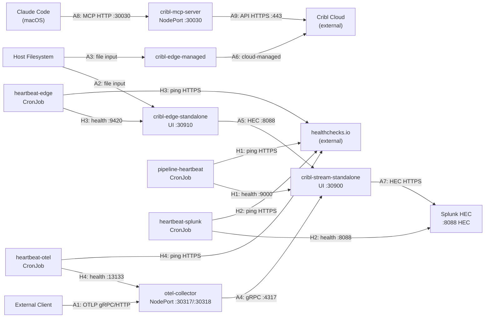

# Architecture: Data Flow and Test Coverage

## Data Flow Diagram

## Test Coverage Map

| Arrow | Path | Test(s) | File |
|-------|------|---------|------|
| A1 | Client → OTEL Collector | `test_send_trace_grpc`, `test_send_trace_http` | test_pipeline.py |
| A2 | Host FS → Edge Standalone | `test_claude_home_mount_accessible`, `test_sentinel_file_visible_in_edge_pod`, `test_edge_file_monitor_config_path`, `test_edge_file_monitor_picks_up_sentinel`, `test_edge_output_not_devnull`, `test_edge_file_input_active` | test_forwarding.py |
| A3 | Host FS → Edge Managed | (file mount, verified by pod health) | test_smoke.py |
| A4 | OTEL Collector → Cribl Stream | `test_no_export_errors_after_send`, `test_cribl_stream_received_otlp_data` | test_forwarding.py |
| A5 | Edge Standalone → Cribl Stream (HEC :8088) | `test_edge_output_not_devnull`, `test_edge_file_input_active`, `test_file_events_reach_splunk_realtime` | test_forwarding.py |
| A6 | Edge Managed → Cribl Cloud | Not locally testable (cloud-managed) | — |
| A7 | Cribl Stream → Splunk HEC | `test_splunk_hec_output_healthy`, `test_splunk_hec_health_endpoint`, `test_splunk_hec_token_accepted`, `test_splunk_hec_url_matches_secret`, `test_cribl_stream_no_output_errors`, `test_cribl_stream_events_flowing`, `test_otlp_events_reach_splunk_realtime` ✓Splunk | test_forwarding.py |
| A2+A5+A7 | Full .claude/projects pipeline (E2E) | `test_file_events_reach_splunk_realtime` ✓Splunk | test_forwarding.py |
| A8 | Claude Code → MCP Server | `test_mcp_initialize_returns_200`, `test_mcp_response_content_type`, `test_mcp_initialize_protocol_version` | test_smoke.py |
| A9 | MCP Server → Cribl Cloud | Not locally testable (cloud-managed) | — |
| H1 | pipeline-heartbeat → Stream health → healthchecks.io | `test_cronjob_exists[pipeline-heartbeat]`, `test_network_policy_exists[allow-heartbeat-egress]` | test_smoke.py |
| H2 | heartbeat-splunk → Splunk HEC health → healthchecks.io | `test_cronjob_exists[heartbeat-splunk]`, `test_network_policy_exists[allow-heartbeat-splunk-egress]` | test_smoke.py |
| H3 | heartbeat-edge → Edge health → healthchecks.io | `test_cronjob_exists[heartbeat-edge]`, `test_network_policy_exists[allow-heartbeat-edge-egress]` | test_smoke.py |
| H4 | heartbeat-otel → OTEL health → healthchecks.io | `test_cronjob_exists[heartbeat-otel]`, `test_network_policy_exists[allow-heartbeat-otel-egress]` | test_smoke.py |
| ST1 | Sourcetype: session | `test_session_sentinel_reaches_splunk` ✓Splunk | test_sourcetypes.py |
| ST2 | Sourcetype: subagent | `test_subagent_sentinel_reaches_splunk` ✓Splunk | test_sourcetypes.py |
| ST3 | Sourcetype: logs | `test_logs_sentinel_reaches_splunk` ✓Splunk | test_sourcetypes.py |
| ST4 | Sourcetype: plans | `test_plans_sentinel_reaches_splunk` ✓Splunk | test_sourcetypes.py |
| ST5 | Sourcetype: tasks | `test_tasks_sentinel_reaches_splunk` ✓Splunk | test_sourcetypes.py |
| ST6 | Sourcetype: teams | `test_teams_sentinel_reaches_splunk` ✓Splunk | test_sourcetypes.py |
| ST7 | Sourcetype: history (query-only) | `test_history_sourcetype_exists` | test_sourcetypes.py |
| ST8 | Sourcetype: stats (query-only) | `test_stats_sourcetype_exists` | test_sourcetypes.py |
| ST9 | Sourcetype: plugins (query-only) | `test_plugins_sourcetype_exists` | test_sourcetypes.py |
| SC1 | Security: no sensitive paths | `test_no_forbidden_patterns_in_edge_inputs_configmap`, `test_forbidden_pattern_not_in_pack_inputs` | test_unit.py |
