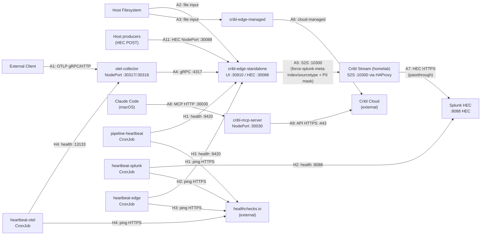

# Architecture: Data Flow and Test Coverage

## Data Flow Diagram

```mermaid
flowchart LR
    Client[External Client]
    HostFS[Host Filesystem]
    HostProducers["Host producers\n(HEC POST)"]
    OtelCollector["otel-collector\nNodePort :30317/:30318"]
    EdgeStandalone["cribl-edge-standalone\nUI :30910 / HEC :30088"]
    EdgeManaged[cribl-edge-managed]
    HomelabStream["Cribl Stream (homelab)\nS2S :10300 via HAProxy"]
    SplunkHEC["Splunk HEC\n:8088 HEC"]
    CriblCloud["Cribl Cloud\n(external)"]
    McpServer["cribl-mcp-server\nNodePort :30030"]
    ClaudeCode["Claude Code\n(macOS)"]
    HCio["healthchecks.io\n(external)"]
    HB1["pipeline-heartbeat\nCronJob"]
    HB2["heartbeat-splunk\nCronJob"]
    HB3["heartbeat-edge\nCronJob"]
    HB4["heartbeat-otel\nCronJob"]

    Client -->|"A1: OTLP gRPC/HTTP"| OtelCollector
    HostFS -->|"A2: file input"| EdgeStandalone
    HostFS -->|"A3: file input"| EdgeManaged
    OtelCollector -->|"A4: gRPC :4317"| EdgeStandalone
    HostProducers -->|"A11: HEC NodePort :30088"| EdgeStandalone
    EdgeStandalone -->|"A5: S2S :10300\n(force-splunk-meta:\nindex/sourcetype + PII mask)"| HomelabStream
    EdgeManaged -->|"A6: cloud-managed"| CriblCloud
    HomelabStream -->|"A7: HEC HTTPS\n(passthrough)"| SplunkHEC
    ClaudeCode -->|"A8: MCP HTTP :30030"| McpServer
    McpServer -->|"A9: API HTTPS :443"| CriblCloud
    HB1 -->|"H1: health :9420"| EdgeStandalone
    HB1 -->|"H1: ping HTTPS"| HCio
    HB2 -->|"H2: health :8088"| SplunkHEC
    HB2 -->|"H2: ping HTTPS"| HCio
    HB3 -->|"H3: health :9420"| EdgeStandalone
    HB3 -->|"H3: ping HTTPS"| HCio
    HB4 -->|"H4: health :13133"| OtelCollector
    HB4 -->|"H4: ping HTTPS"| HCio
```

## Test Coverage Map

| Arrow | Path | Test(s) | File |
|-------|------|---------|------|
| A1 | Client → OTEL Collector | `test_send_trace_grpc`, `test_send_trace_http` | test_pipeline.py |
| A2 | Host FS → Edge Standalone | `test_claude_home_mount_accessible`, `test_sentinel_file_visible_in_edge_pod`, `test_edge_file_monitor_config_path`, `test_edge_file_monitor_picks_up_sentinel`, `test_edge_output_not_devnull`, `test_edge_file_input_active` | test_forwarding.py |
| A3 | Host FS → Edge Managed | (file mount, verified by pod health) | test_smoke.py |
| A4 | OTEL Collector → Cribl Edge | `test_no_export_errors_after_send`, `test_cribl_edge_received_otlp_data` | test_forwarding.py |
| A5 | Edge Standalone → homelab Cribl Stream (S2S :10300) | `test_edge_output_not_devnull`, `test_edge_file_input_active`, `test_cribl_edge_no_output_errors`, `test_cribl_edge_events_flowing` | test_forwarding.py |
| A6 | Edge Managed → Cribl Cloud | Not locally testable (cloud-managed) | — |
| A7 | homelab Cribl Stream → Splunk HEC (passthrough) | `test_otlp_events_reach_splunk_realtime` ✓Splunk (E2E; the homelab Stream itself is not reachable from CI) | test_forwarding.py |
| A2+A5+A7 | Full .claude/projects pipeline (E2E) | `test_file_events_reach_splunk_realtime` ✓Splunk | test_forwarding.py |
| A8 | Claude Code → MCP Server | `test_mcp_initialize_returns_200`, `test_mcp_response_content_type`, `test_mcp_initialize_protocol_version` | test_smoke.py |
| A9 | MCP Server → Cribl Cloud | Not locally testable (cloud-managed) | — |
| A11 | Host producers → Edge HEC (NodePort :30088) | `test_cribl_edge_standalone_hec_service` | test_smoke.py |
| H1 | pipeline-heartbeat → Edge health → healthchecks.io | `test_cronjob_exists[pipeline-heartbeat]`, `test_network_policy_exists[allow-heartbeat-egress]` | test_smoke.py |
| H2 | heartbeat-splunk → Splunk HEC health → healthchecks.io | `test_cronjob_exists[heartbeat-splunk]`, `test_network_policy_exists[allow-heartbeat-splunk-egress]` | test_smoke.py |
| H3 | heartbeat-edge → Edge health → healthchecks.io | `test_cronjob_exists[heartbeat-edge]`, `test_network_policy_exists[allow-heartbeat-edge-egress]` | test_smoke.py |
| H4 | heartbeat-otel → OTEL health → healthchecks.io | `test_cronjob_exists[heartbeat-otel]`, `test_network_policy_exists[allow-heartbeat-otel-egress]` | test_smoke.py |
| ST1 | Sourcetype: session | `test_session_sourcetype` ✓Splunk | test_sourcetypes.py |
| ST2 | Sourcetype: subagent | `test_subagent_sourcetype` ✓Splunk | test_sourcetypes.py |
| ST3 | Sourcetype: logs | `test_logs_sourcetype` ✓Splunk | test_sourcetypes.py |
| ST4 | Sourcetype: plans | `test_plans_sourcetype` ✓Splunk | test_sourcetypes.py |
| ST5 | Sourcetype: tasks | `test_tasks_sourcetype` ✓Splunk | test_sourcetypes.py |
| ST6 | Sourcetype: teams | `test_teams_sourcetype` ✓Splunk | test_sourcetypes.py |
| ST7 | Sourcetype: history (query-only) | `test_history_sourcetype_exists` | test_sourcetypes.py |
| ST8 | Sourcetype: stats (query-only) | `test_stats_sourcetype_exists` | test_sourcetypes.py |
| ST9 | Sourcetype: plugins (query-only) | `test_plugins_sourcetype_exists` | test_sourcetypes.py |
| ST10 | Sourcetype: gemini:cli:session | `test_gemini_session_sourcetype` ✓Splunk | test_sourcetypes.py |
| ST11 | Sourcetype: gemini:cli:logs | `test_gemini_cli_sourcetypes_exist` ✓Splunk (wildcard `gemini:cli:*`) | test_sourcetypes.py |
| ST12 | Sourcetype: copilot:chat:otel | Not locally testable (requires Copilot Chat OTEL data) | — |
| SC1 | Security: no sensitive paths | `test_no_forbidden_patterns_in_edge_inputs_configmap`, `test_forbidden_pattern_not_in_pack_inputs` | test_unit.py |
